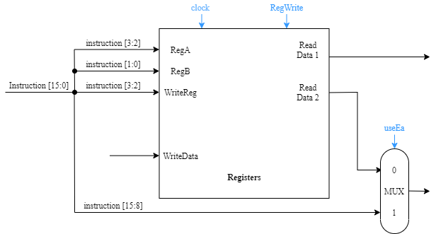

# SingleCycleProcessor
Final project for EELE-0651.  Simple single Cccle processor in verlog.

The purpose of this project was to design and implement an 8-bit single cycle processor
modelled with Verilog using Intel Quartus Prime Lite software and simulated using ModelSim software and finally implemented on an Alter DE10-Lite board. Unfortunately, due to COVID-19 and the current world climate, we were unable to have access to the lab and physically implement our processor on the FPGA.

A lot of the diagrams will look better in githubs **light theme**.  Sorry in advance.

# Overview
The single cycle processor uses a RISC-like instruction set where each instruction in the
processor is 2-bytes. Four 1-byte general purpose registers are implemented: R0,  R1, R2, and R3.  In addition, a link register is also implemented to support subroutines. Three different instruction formats are used: A-Format, B-Format, and L-Format which are described further in the next section.
# Instruction Set
The instruction set provided was used when designing our single cycle processor, based
on the format given we were able to then code the instruction set in verilog. Sixteen instructions are supported and implemented in three formats described below.
## A-Format
A-format is used for arithmetic and logical instructions. Instructions are two bytes,
however the second byte is unused. The first byte holds the opcode to define the operation to be performed and holds the source and destination operand. There are 9 A-format instructions.

Mnemonic  | Op-Code  | Function
:-------:|:-------:|:-------:
NOP | 0 | Nothing
ADD | 1 | R[ra] ← R[ra] + R[rb];   $((R[ra] + R[rb]) = 0) ⇒ Z ← 1; else ⇒ Z  ← 0;$   $((R[ra] + R[rb]) < 0) ⇒ N ← 1; else ⇒ N ← 0;$
SUB | 2 | $R[ra] ← R[ra] − R[rb];$   $((R[ra] − R[rb]) = 0) ⇒ Z ← 1; else ⇒ Z ← 0;$   $((R[ra] − R[rb]) < 0) ⇒ N ← 1; else ⇒ N ← 0;$ 
NAND | 3| 

*Table 1: A-Format Instructions*

## B-Format
## L-Format
# Implementation
To build our processor, we used the provided instruction set to guide our design and select the
main components needed for our design. Before coding our modules for each component, we
needed to determine the data paths for each instruction format which are shown below.
## A-Format Data Path
</img>
*Figure 4: ADD, SUB, NAND Data Path*

</img>
*Figure 5: SHL and SHR Data Path*

</img>
*Figure 6: OUT Data Path*

</img>
*Figure 7: IN Data Path*

</img>
*Figure 8: MOV Data Path*

## B-Format Data Path
## L-Format Data Path
# Components
## Single Cycle Processor
</img>

*Figure 15: Full Single Cycle Processor Diagram*

## Instruction Memory
The purpose of the Instruction Memory module is to, given an address, lookup its value
in instruction memory and output its value. Instruction memory stores 1 byte per memory
address. Because instructions for the single cycle processor are 2 bytes long, the instruction
memory module looks up the memory address given and the memory address given plus 1.
These two values are concatenated together for the output. A diagram of the instruction memory
can be seen in figure 16.

</img>

*Figure 16: Full Single Cycle Processor Diagram*

## Control
The control module is responsible for setting certain flags on or off.  These flags are used by various other modules.  Depending on the OPcode given to the module, different flags will be raised. A truth table for the different OPcodes and which flags get raised can be seen in table 4.

</img>

*Figure 17: Control Module Diagram*

| | **instruction[7:4]** | **branchControl** | **memtoReg** | **RegWrite** | **useEa** | **ALUOP** | **memRead** | **linkSrc** | **memWrite** | 
| ---: | :---: | :---: | :---: | :---: | :---: | :---: | :---: | :---: | :---: | 
| **NOP** | 0000 | 00 | 0 | 0 | 0 | 0 | 0 | 0 | 0 | 
| **ADD** | 0001 | 00 | 0 | 1 | 0 | 0 | 0 | 0 | 0 | 
| **SUB** | 0010 | 0 | 0 | 1 | 0 | 0 | 0 | 0 | 0 | 
| **NAND** | 0011 | 0 | 0 | 1 | 0 | 0 | 0 | 0 | 0 | 
| **SHL** | 0100 | 0 | 0 | 1 | 0 | 0 | 0 | 0 | 0 | 
| **SHR** | 0101 | 0 | 0 | 1 | 0 | 0 | 0 | 0 | 0 | 
| **OUT** | 0110 | 0 | 0 | 0 | 0 | 0 | 0 | 0 | 0 | 
| **IN** | 0111 | 0 | 0 | 1 | 0 | 0 | 0 | 0 | 0 | 
| **MOV** | 1000 | 0 | 0 | 1 | 0 | 0 | 0 | 0 | 0 | 
| **BR** | 1001 | 00 | 0 | 0 | 1 | 0 | 0 | 1 | 0 | 
| **BR.C** | 1010 | 01 | 0 | 0 | 1 | 0 | 0 | 1 | 0 | 
| **BR.SUB** | 1011 | 10 | 0 | 0 | 1 | 0 | 0 | 1 | 0 | 
| **RETURN** | 1100 | 11 | 0 | 0 | 1 | 0 | 0 | 1 | 0 | 
| **LOAD** | 1101 | 0 | 1 | 1 | 1 | 0 | 1 | 0 | 0 | 
| **STORE** | 1110 | 0 | 0 | 0 | 1 | 0 | 0 | 0 | 1 | 
| **LOADIMM** | 1111 | 0 | 0 | 0 | 1 | 0 | 0 | 1 | 0 |

*Table 4: Control Module Truth Table*

## Registers
The register module has two jobs; reading from registers and writing to registers.  For reading, the module is given two 2-bit values to lookup.  The module then outputs these values through Read Data 1 and Read Data 2.  Some OPCodes make use of the second byte in the instruction (bits 15 - 8 of the instruction).  To handle this, the second bytes and Read Data 2 are passed through a 2-1 MUX controlled by the useEA flag.  When writing to registers, the register module uses WriteReg as the index for which register to write to and writeData as the value to write to.  The module attempts to write each clock cycle.  The module will not write unless the regWrite flag is raised.

</img>

*Figure 18: Registers Modules Diagram*

## Link Registers
The link register is used to store the next PC address during subroutine branch operations, and can restore the PC value to the stored state after the subroutine has returned. It also sets the PC to the Ea value during BR, BR.Z, and BR.N operations. 

</img>

*Figure 19: Link Register Diagram*
## ALU
The ALU module will perform different operations on its inputs value1 and value2 depending on the ALUOP flag. Table 1,2 and 3 show the respective operations for each ALUOP.  The ALU will raise the zero and negative flag in some cases.  These cases can be seen in table 1.   

</img>

*Figure 20: ALU Module Diagram*

## Data Memory
The Data Memory module performs three operations; reading from data memory, writing to data memory and passing the ALU result to the register module.  If the memWrite flag is raised, the module will write readData1 into data memory at the value of ALUResult.  If the memRead flag is raised, it will read a value at ALUResult and send it to readData.  If the memToReg flag is not raised, the ALU value is passed through the 2-1 mux and then to the register module.           

</img>

*Figure 22: Data Memory Module Diagram*

# Results

For this project we were able to design and implement an 8-bit single cycle processor successfully. Given the provided instruction set we were able to design datapaths for each instruction type and then code each component in Verilog. We were able to simulate our CPU in ModelSim with a given instruction memory which gave us our desired output shown below.

</img>
*Figure 23: CPU Waveform for Provided Instruction Memory in ModelSim*

The expected output of the CPU module when given a steady clock cycle is 0x81, 0xC3, 0xE7, 0xFF, 0xE7, 0xC3, 0x81.  These outputs will repeat indefinitely, as seen in figure 21.  The CPU module outputted the expected value.

# Future works
If the single cycle processor were to be improved, one of the major things would be to allow for shifting bits by more than 1.  This can easily be done with the current A-Format structure.  Secondly, the single cycle processor was only ever simulated.  The next steps would be to attempt to run the code on a FPGA board.  The project code would need to be modified in order to run on a FPGA board.  This is mainly because of how instruction memory is initialized, as currently its contents are loaded from a file.  For the single cycle processor to function on an FPGA board, instruction memory would need to be hard coded.